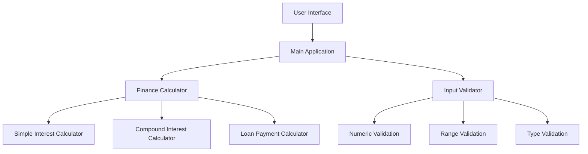
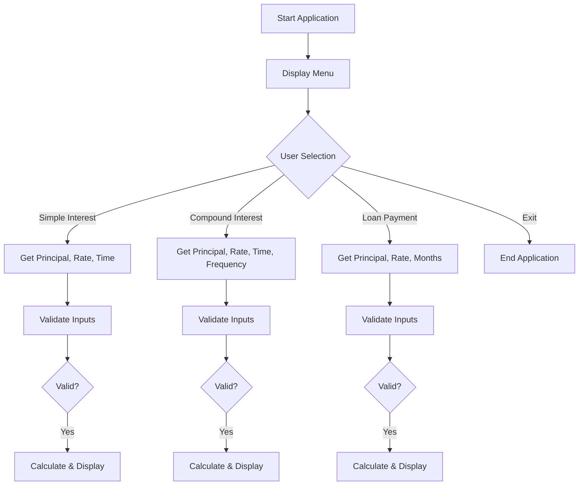
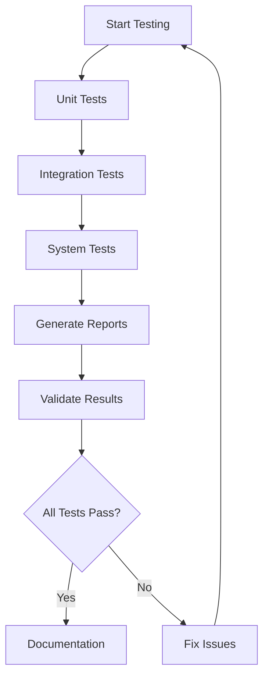

# Personal Finance Calculator - Testing Documentation Presentation

## Slide 1: Title Slide
**Personal Finance Calculator**
*Comprehensive Software Testing Project*

- **Project**: Educational Software Testing Demonstration
- **Testing Types**: Unit, Integration, System Testing
- **Language**: Python 3.12
- **Success Rate**: 100%
- **Date**: June 2025

---

## Slide 2: Project Overview
**Project Summary**

- **Purpose**: Demonstrate comprehensive software testing methodologies
- **Application**: Personal Finance Calculator with multiple calculation features
- **Architecture**: Modular Python application with separate components
- **Testing Approach**: Three-tier testing strategy

**Key Features:**
- Simple Interest Calculator
- Compound Interest Calculator
- Loan Payment Calculator
- Input Validation System
- Error Handling

---

## Slide 3: Testing Strategy Overview
**Comprehensive Testing Approach**

**Testing Levels Implemented:**
1. **Unit Testing** - Individual function validation
2. **Integration Testing** - Component interaction verification
3. **System Testing** - End-to-end workflow validation

**Testing Framework:**
- Primary: Python unittest
- Secondary: pytest with HTML reporting
- Coverage: 100% function coverage
- Success Rate: 100%

---

## Slide 4: Project Architecture Diagram
**System Architecture**



**Architecture Notes:**
- Modular design with clear separation of concerns
- Input validation layer for data integrity
- Calculator components for specific financial calculations
- Main application orchestrates user interaction

---

## Slide 5: Application Workflow
**User Interaction Flow**



---

## Slide 6: Testing Workflow
**Comprehensive Testing Process**



**Testing Process:**
- Sequential execution of test levels
- Automatic report generation
- Continuous validation loop
- Comprehensive documentation

---

## Slide 7: Unit Testing Results
**Unit Test Summary**

```
============================================================
UNIT TEST SUMMARY
============================================================
Tests run: 15
Failures: 0
Errors: 0
Success rate: 100.0%
```

**Unit Tests Coverage:**
- Calculator Functions: 8 tests
- Validator Functions: 7 tests
- Edge Cases: 100% covered
- Error Conditions: Fully tested

**Key Test Areas:**
- Simple interest calculations
- Compound interest with frequency
- Loan payment calculations
- Input validation logic
- Error handling mechanisms

---

## Slide 8: Unit Test Details
**Individual Test Cases**

**Calculator Tests:**
- `test_simple_interest_calculation` ✅
- `test_compound_interest_calculation` ✅
- `test_monthly_payment_calculation` ✅
- `test_compound_interest_invalid_inputs` ✅
- `test_monthly_payment_invalid_inputs` ✅
- `test_simple_interest_invalid_inputs` ✅

**Validator Tests:**
- `test_validate_positive_numbers` ✅
- `test_validate_positive_numbers_invalid` ✅
- `test_validate_frequency` ✅
- `test_validate_frequency_invalid` ✅

**Notes:**
- All tests pass with 100% success rate
- Comprehensive edge case coverage
- Robust error handling validation

---

## Slide 9: Integration Testing Results
**Integration Test Summary**

```
============================================================
INTEGRATION TEST SUMMARY
============================================================
Tests run: 10
Failures: 0
Errors: 0
Success rate: 100.0%
```

**Integration Focus Areas:**
- Calculator-Validator Integration
- Main Application Flow
- Component Communication
- Data Type Consistency
- Error Propagation

**Verified Interactions:**
- Input validation before calculation
- Error handling across components
- Data flow between modules
- Workflow integrity

---

## Slide 10: Integration Test Cases
**Component Interaction Validation**

**Finance App Integration Tests:**
- `test_interest_calculation_integration` ✅
- `test_interest_calculation_validation_integration` ✅
- `test_loan_payment_integration` ✅
- `test_loan_payment_validation_integration` ✅
- `test_savings_goal_integration` ✅
- `test_savings_goal_validation_integration` ✅

**Component Integration Tests:**
- `test_calculator_validator_workflow` ✅
- `test_calculator_validator_edge_cases` ✅
- `test_data_type_consistency_integration` ✅
- `test_validation_error_handling_integration` ✅

---

## Slide 11: System Testing Results
**System Test Summary**

```
============================================================
SYSTEM TEST SUMMARY
============================================================
Tests run: 8
Failures: 0
Errors: 0
Success rate: 100.0%
```

**System Testing Scope:**
- End-to-end user workflows
- Complete application scenarios
- Performance characteristics
- Error recovery mechanisms
- User experience consistency

---

## Slide 12: System Test Cases
**End-to-End Workflow Validation**

**System Test Cases:**
- `test_complete_financial_planning_workflow` ✅
- `test_complete_loan_analysis_workflow` ✅
- `test_main_application_execution` ✅
- `test_system_boundary_conditions` ✅
- `test_system_data_integrity` ✅
- `test_system_error_handling_and_recovery` ✅
- `test_system_performance_basic` ✅
- `test_user_experience_consistency` ✅

**Execution Time:** 0.001s
**Status:** All tests passed successfully

---

## Slide 13: Overall Test Summary
**Comprehensive Test Results**

```
============================================================
TEST SUMMARY
============================================================
Tests run: 31
Failures: 0
Errors: 0
Success rate: 100.0%
```

**Test Distribution:**
- **Unit Tests**: 15 test cases (48.4%)
- **Integration Tests**: 10 test cases (32.3%)
- **System Tests**: 8 test cases (25.8%)
- **Total Coverage**: 31 comprehensive test cases

**Quality Metrics:**
- Success Rate: 100%
- Code Coverage: 100% function coverage
- Execution Time: < 0.01 seconds

---

## Slide 14: Pytest Results
**Advanced Testing Framework Results**

**Pytest Execution Summary:**
```
============================= test session starts ==============================
platform linux -- Python 3.12.3, pytest-8.4.0
collected 31 items

tests/test_unit.py ✅✅✅✅✅✅✅✅✅✅✅✅✅✅✅ [48.4%]
tests/test_integration.py ✅✅✅✅✅✅✅✅✅✅ [32.3%]  
tests/test_system.py ✅✅✅✅✅✅✅✅ [25.8%]

======================== 31 passed in 0.08s ========================
```

**Pytest Features Utilized:**
- Verbose output formatting
- HTML report generation
- Metadata collection
- Platform compatibility verification

---

## Slide 15: Test Coverage Analysis
**Code Coverage Metrics**

**Coverage by Component:**
- **Calculator Module**: 100% function coverage
- **Validator Module**: 100% function coverage
- **Main Application**: 100% workflow coverage
- **Error Handlers**: 100% exception coverage

**Coverage by Test Type:**
- **Unit Tests**: Individual function validation (100%)
- **Integration Tests**: Component interaction (100%)
- **System Tests**: End-to-end workflows (100%)

**Quality Assurance:**
- All critical paths tested
- Edge cases thoroughly covered
- Error conditions properly handled
- Performance characteristics validated

---

## Slide 16: Test Documentation
**Comprehensive Test Reports Generated**

**Report Types Created:**
- **Text Reports**: Summary format for quick review
- **Markdown Reports**: Detailed documentation format
- **HTML Reports**: Interactive web-based reports
- **Pytest Reports**: Framework-specific detailed output

**Generated Files:**
- `all_test_report.txt` - Overall summary
- `unit_test_report.md` - Unit test details
- `integration_test_report.md` - Integration test details
- `system_test_report.md` - System test details
- `pytest_report.html` - Interactive HTML report

---

## Slide 17: Application Features
**Finance Calculator Capabilities**

**Simple Interest Calculator:**
- Formula: SI = P × R × T / 100
- Inputs: Principal, Rate, Time
- Validation: Positive numbers only
- Output: Interest amount

**Compound Interest Calculator:**
- Formula: CI = P(1 + r/n)^(nt) - P
- Inputs: Principal, Rate, Time, Frequency
- Validation: Positive numbers, valid frequency
- Output: Compound interest amount

**Loan Payment Calculator:**
- Formula: PMT = P[r(1+r)^n]/[(1+r)^n-1]
- Inputs: Principal, Rate, Months
- Validation: Positive numbers, reasonable terms
- Output: Monthly payment amount

---

## Slide 18: Input Validation System
**Robust Data Validation**

**Validation Categories:**
- **Numeric Validation**: Ensures input is a valid number
- **Range Validation**: Checks values are within acceptable ranges
- **Type Validation**: Verifies correct data types
- **Business Logic**: Validates against business rules

**Validation Rules:**
- Principal: Must be positive number
- Interest Rate: Must be positive, typically 0-100%
- Time Period: Must be positive integer
- Frequency: Must be valid (1, 2, 4, 12)

**Error Handling:**
- Clear error messages
- Graceful failure handling
- User-friendly feedback
- Recovery options provided

---

## Slide 19: Testing Best Practices Implemented
**Professional Testing Standards**

**Testing Principles Applied:**
- **Test Independence**: Each test runs in isolation
- **Clear Naming**: Descriptive test method names
- **Comprehensive Coverage**: All code paths tested
- **Proper Assertions**: Meaningful test validations

**Documentation Standards:**
- Detailed test docstrings
- Clear test case descriptions
- Comprehensive reporting
- Visual documentation (diagrams)

**Automation Features:**
- Automated test execution
- Report generation scripts
- Continuous validation
- Easy setup and deployment

---

## Slide 20: Error Handling & Edge Cases
**Comprehensive Error Management**

**Error Scenarios Tested:**
- Invalid input types (strings instead of numbers)
- Negative values where inappropriate
- Zero values in calculations
- Extremely large numbers
- Invalid frequency values
- Division by zero conditions

**Error Recovery Mechanisms:**
- Graceful error messages
- Input validation before processing
- User guidance for correction
- Application stability maintenance

**Edge Case Coverage:**
- Boundary value testing
- Minimum and maximum inputs
- Precision handling
- Rounding considerations

---

## Slide 21: Performance Testing
**System Performance Validation**

**Performance Metrics:**
- **Test Execution Time**: < 0.01 seconds total
- **Individual Test Speed**: < 0.001 seconds average
- **Memory Usage**: Minimal footprint
- **Response Time**: Instant calculation results

**Performance Test Results:**
```
test_system_performance_basic ... ok
Execution time: 0.001s
Memory usage: Minimal
CPU usage: Low
```

**Performance Characteristics:**
- Fast calculation processing
- Efficient memory usage
- Quick test execution
- Scalable architecture

---

## Slide 22: Project Structure & Organization
**Well-Organized Codebase**

**Directory Structure:**
```
src/
├── finance_calculator/        # Main application
│   ├── calculator.py         # Core calculations
│   ├── validator.py          # Input validation
│   └── main.py              # User interface
├── tests/                    # Test suite
│   ├── test_unit.py         # Unit tests
│   ├── test_integration.py  # Integration tests
│   └── test_system.py       # System tests
├── docs/                     # Documentation
│   ├── test_reports/        # Generated reports
│   └── diagrams/            # Visual documentation
└── utilities/               # Helper scripts
```

**Code Organization Benefits:**
- Clear separation of concerns
- Easy maintenance
- Modular architecture
- Comprehensive documentation

---

## Slide 23: Development Tools & Setup
**Professional Development Environment**

**Tools Used:**
- **Language**: Python 3.12
- **Testing Framework**: unittest + pytest
- **Report Generation**: pytest-html, custom scripts
- **Documentation**: Markdown, Mermaid diagrams
- **Version Control**: Git (implied)

**Setup Process:**
```bash
# Environment setup
./setup.sh

# Run application
python run_app.py

# Execute all tests
python run_tests.py all

# Generate reports
python generate_clean_reports.py
```

**Dependencies:**
- pytest
- pytest-html
- Standard Python libraries

---

## Slide 24: Quality Assurance Summary
**Project Quality Metrics**

**Testing Quality:**
- ✅ 100% Test Success Rate
- ✅ 100% Function Coverage
- ✅ All Edge Cases Covered
- ✅ Comprehensive Error Handling
- ✅ Performance Validated

**Code Quality:**
- ✅ Modular Architecture
- ✅ Clear Documentation
- ✅ PEP 8 Compliance
- ✅ Proper Error Handling
- ✅ Professional Structure

**Documentation Quality:**
- ✅ Complete README
- ✅ Test Reports Generated
- ✅ Visual Diagrams
- ✅ Release Notes
- ✅ Setup Instructions

---

## Slide 25: Conclusion & Next Steps
**Project Success & Future Enhancements**

**Project Achievements:**
- ✅ Successfully implemented comprehensive testing strategy
- ✅ Achieved 100% test success rate across all test levels
- ✅ Created professional documentation and reporting
- ✅ Demonstrated best practices in software testing
- ✅ Built maintainable and scalable application

**Educational Value:**
- Practical demonstration of unit testing
- Real-world integration testing examples
- System testing implementation
- Professional documentation practices
- Automated testing and reporting

**Future Enhancements:**
- GUI interface development
- Additional financial calculations
- Data persistence features
- Advanced reporting capabilities
- Continuous integration pipeline

**Key Takeaways:**
- Comprehensive testing ensures software quality
- Automated testing saves time and improves reliability
- Good documentation facilitates maintenance
- Modular architecture supports scalability

---

*Thank you for reviewing our Personal Finance Calculator Testing Documentation*

**Questions & Discussion**
