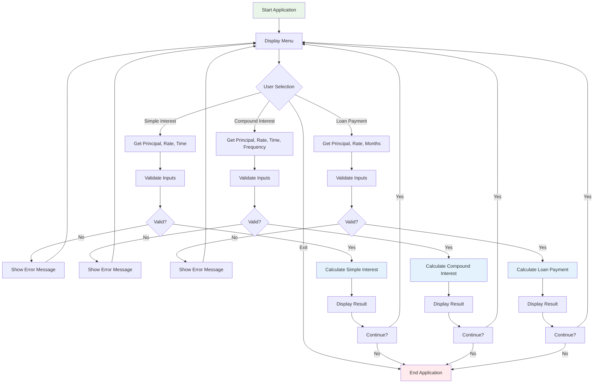

# Application Flowchart

```mermaid
flowchart TD
    A[Start Application] --> B[Display Menu]
    B --> C{User Selection}
    C -->|Simple Interest| D[Get Principal, Rate, Time]
    C -->|Compound Interest| E[Get Principal, Rate, Time, Frequency]
    C -->|Loan Payment| F[Get Principal, Rate, Months]
    C -->|Exit| G[End Application]
    
    D --> H[Validate Inputs]
    E --> I[Validate Inputs]
    F --> J[Validate Inputs]
    
    H --> K{Valid?}
    I --> L{Valid?}
    J --> M{Valid?}
    
    K -->|No| N[Show Error Message]
    L -->|No| O[Show Error Message]
    M -->|No| P[Show Error Message]
    
    K -->|Yes| Q[Calculate Simple Interest]
    L -->|Yes| R[Calculate Compound Interest]
    M -->|Yes| S[Calculate Loan Payment]
    
    Q --> T[Display Result]
    R --> U[Display Result]
    S --> V[Display Result]
    
    T --> W[Continue?]
    U --> X[Continue?]
    V --> Y[Continue?]
    
    W -->|Yes| B
    X -->|Yes| B
    Y -->|Yes| B
    
    W -->|No| G
    X -->|No| G
    Y -->|No| G
    
    N --> B
    O --> B
    P --> B
    
    style A fill:#e8f5e8
    style G fill:#ffebee
    style Q fill:#e3f2fd
    style R fill:#e3f2fd
    style S fill:#e3f2fd
```

This flowchart demonstrates the complete user workflow through the Personal Finance Calculator application.
