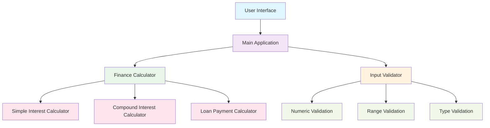

# Application Architecture Diagram

```mermaid
graph TB
    A[User Interface] --> B[Main Application]
    B --> C[Finance Calculator]
    B --> D[Input Validator]
    C --> E[Simple Interest Calculator]
    C --> F[Compound Interest Calculator]
    C --> G[Loan Payment Calculator]
    D --> H[Numeric Validation]
    D --> I[Range Validation]
    D --> J[Type Validation]
    
    style A fill:#e1f5fe
    style B fill:#f3e5f5
    style C fill:#e8f5e8
    style D fill:#fff3e0
    style E fill:#fce4ec
    style F fill:#fce4ec
    style G fill:#fce4ec
    style H fill:#f1f8e9
    style I fill:#f1f8e9
    style J fill:#f1f8e9
```

This diagram shows the hierarchical structure of the Personal Finance Calculator application, illustrating how different components interact with each other.
