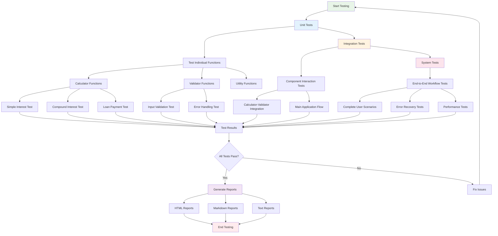

# Testing Workflow Diagram

```mermaid
graph TD
    A[Start Testing] --> B[Unit Tests]
    B --> C[Test Individual Functions]
    C --> D[Calculator Functions]
    C --> E[Validator Functions]
    C --> F[Utility Functions]
    
    D --> G[Simple Interest Test]
    D --> H[Compound Interest Test]
    D --> I[Loan Payment Test]
    
    E --> J[Input Validation Test]
    E --> K[Error Handling Test]
    
    B --> L[Integration Tests]
    L --> M[Component Interaction Tests]
    M --> N[Calculator-Validator Integration]
    M --> O[Main Application Flow]
    
    L --> P[System Tests]
    P --> Q[End-to-End Workflow Tests]
    Q --> R[Complete User Scenarios]
    Q --> S[Error Recovery Tests]
    Q --> T[Performance Tests]
    
    G --> U[Test Results]
    H --> U
    I --> U
    J --> U
    K --> U
    N --> U
    O --> U
    R --> U
    S --> U
    T --> U
    
    U --> V{All Tests Pass?}
    V -->|Yes| W[Generate Reports]
    V -->|No| X[Fix Issues]
    X --> A
    
    W --> Y[HTML Reports]
    W --> Z[Markdown Reports]
    W --> AA[Text Reports]
    
    Y --> BB[End Testing]
    Z --> BB
    AA --> BB
    
    style A fill:#e8f5e8
    style B fill:#e3f2fd
    style L fill:#fff3e0
    style P fill:#fce4ec
    style W fill:#f3e5f5
    style BB fill:#ffebee
```

This diagram illustrates the comprehensive testing workflow implemented for the Personal Finance Calculator project.
